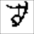

                   

                 

                    

                    


An [MXNet](https://mxnet.incubator.apache.org/) implementation of the recurrent latent variational autoencoder model ConvDRAW proposed in [1].

`core.py` implements the model and loss function. 

`train_omniglot.py`trains DRAW on OmniGlot dataset.  

Look at the `../data/omniglot_to_ndarray.py` script to see how to get the dataset.

In the figure above, you see samples from the model trained on OmniGlot with the default parameters (for 500,000 training samples). The final log negative log likelihood is around 70 nats. This is much lower than what is reported in the paper but note that the dataset here is not the same with the dataset used in the paper. So these numbers are probably not comparable. Note the pictures above are true samples from the model, not the reconstructions for real images in the training or validation sets.

```
usage: train_omniglot.py [-h] [--batch_size BATCH_SIZE]
                         [--num_steps NUM_STEPS]
                         [--num_latent_maps NUM_LATENT_MAPS]
                         [--num_recurrent_maps NUM_RECURRENT_MAPS]
                         [--learning_rate LEARNING_RATE]
                         [--num_train_samples NUM_TRAIN_SAMPLES]
                         [--num_val_samples NUM_VAL_SAMPLES]
                         [--val_freq VAL_FREQ] [--gpu] [--logdir LOGDIR]

Train ConvDRAW on Omniglot dataset

optional arguments:
  -h, --help            show this help message and exit
  --batch_size BATCH_SIZE, -b BATCH_SIZE
                        Batch size
  --num_steps NUM_STEPS, -s NUM_STEPS
                        Number of recurrent steps
  --num_latent_maps NUM_LATENT_MAPS, -l NUM_LATENT_MAPS
                        Number of latent feature maps.
  --num_recurrent_maps NUM_RECURRENT_MAPS, -u NUM_RECURRENT_MAPS
                        Number of feature maps in recurrent encoder and
                        decoder
  --learning_rate LEARNING_RATE, -r LEARNING_RATE
                        Learning rate
  --num_train_samples NUM_TRAIN_SAMPLES, -t NUM_TRAIN_SAMPLES
                        Number of training samples
  --num_val_samples NUM_VAL_SAMPLES, -v NUM_VAL_SAMPLES
                        Number of validation samples (per validation run)
  --val_freq VAL_FREQ, -f VAL_FREQ
                        Validation frequency (run validation every val_freq
                        training samples)
  --gpu                 If True, train on GPU
  --logdir LOGDIR       Log directory for mxboard.
```

This script uses `tensorboard` to plot training/validation metrics. Point `tensorboard` to log directory you specified.
```
tensorboard --logdir=results
```

[1] K. Gregor, F. Besse, D. J. Rezende, I. Danihelka, and D. Wierstra, “Towards Conceptual Compression” arXiv:1604.08772 [stat.ML], Apr. 2015.
