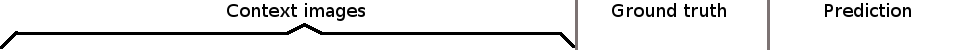 
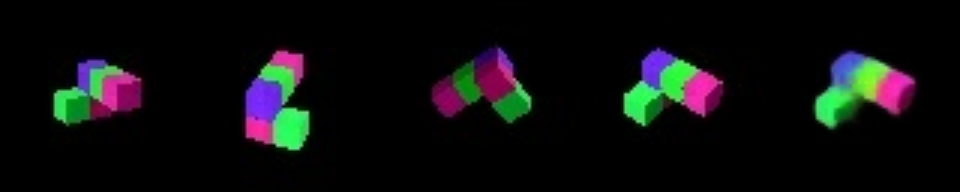
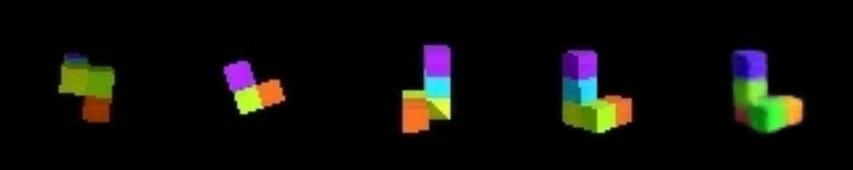
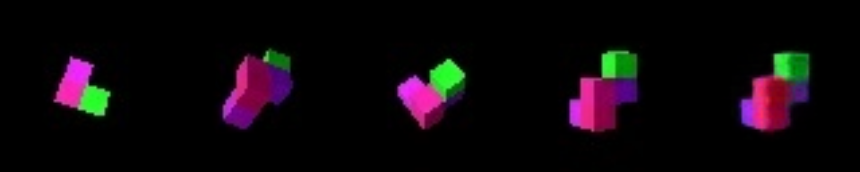
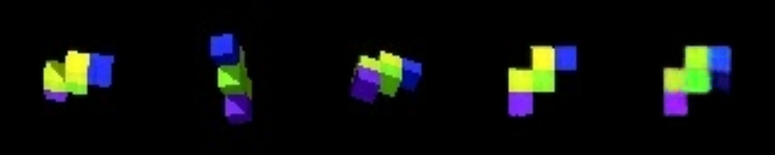
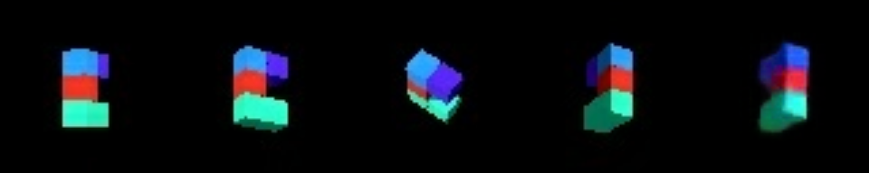
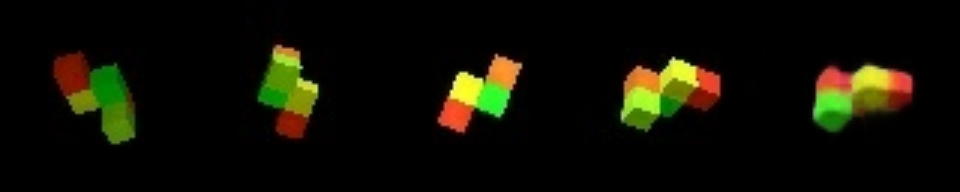
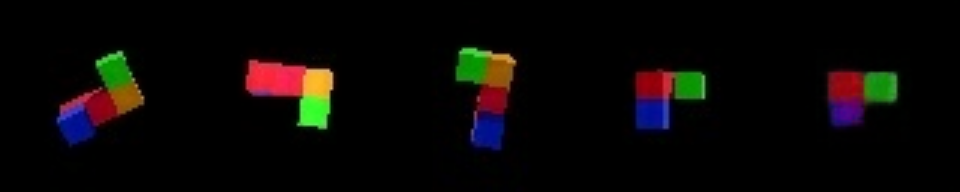
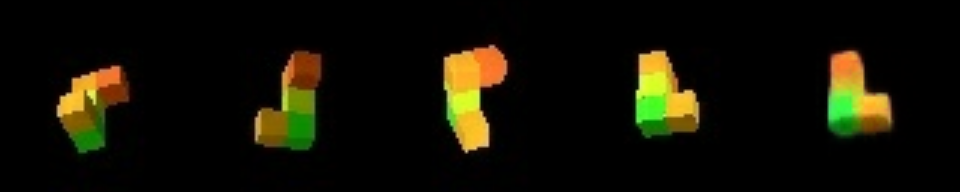
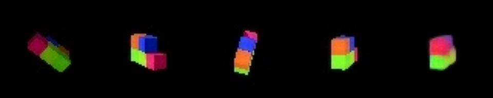
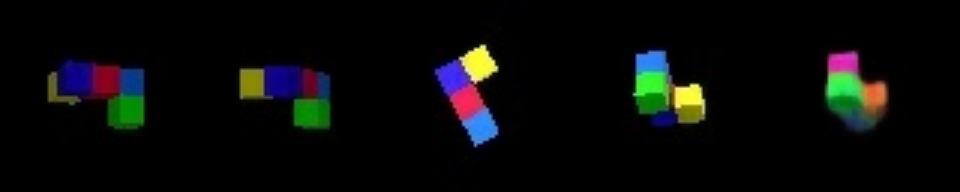


An [MXNet](https://mxnet.incubator.apache.org/) implementation of the Generative Query Network model proposed in [1].

`core.py` implements the model and loss function. 

`train_gqn.py`trains GQN on a dataset.  

Look at the `../data/gqn_data_to_recordio.py` script to see how to get the GQN datasets and convert them to MXNet recordio format.

In the figure above, you see predictions from the model trained on shepard-metzler 5-parts dataset. First three columns are the context images, fourth column is the true image of how the object looks from the query viewpoint, and the last column is the prediction from the model.

Note that this model was trained for much fewer updates than the models reported in the paper, and there is certainly room for improvement. For reference, the model in the paper is trained for 2M updates (=72M training samples), and the model used in the above figure is only trained for ~200K updates (=7M training samples).

```
usage: train_gqn.py [-h] [--dataset_name DATASET_NAME]
                    [--max_context_size MAX_CONTEXT_SIZE]
                    [--batch_size BATCH_SIZE] [--num_steps NUM_STEPS]
                    [--num_latent_maps NUM_LATENT_MAPS]
                    [--num_recurrent_maps NUM_RECURRENT_MAPS]
                    [--pixel_std_initial PIXEL_STD_INITIAL]
                    [--pixel_std_final PIXEL_STD_FINAL]
                    [--learning_rate_initial LEARNING_RATE_INITIAL]
                    [--learning_rate_final LEARNING_RATE_FINAL]
                    [--num_train_samples NUM_TRAIN_SAMPLES]
                    [--num_val_samples NUM_VAL_SAMPLES] [--val_freq VAL_FREQ]
                    [--run_suffix RUN_SUFFIX] [--gpu] [--logdir LOGDIR]

Train Generative Query Network

optional arguments:
  -h, --help            show this help message and exit
  --dataset_name DATASET_NAME, -d DATASET_NAME
                        Dataset name
  --max_context_size MAX_CONTEXT_SIZE, -c MAX_CONTEXT_SIZE
                        Maximum number of views in context
  --batch_size BATCH_SIZE, -b BATCH_SIZE
                        Batch size
  --num_steps NUM_STEPS, -s NUM_STEPS
                        Number of recurrent steps
  --num_latent_maps NUM_LATENT_MAPS, -l NUM_LATENT_MAPS
                        Number of latent feature maps
  --num_recurrent_maps NUM_RECURRENT_MAPS, -u NUM_RECURRENT_MAPS
                        Number of feature maps in recurrent encoder and
                        decoder
  --pixel_std_initial PIXEL_STD_INITIAL, -pi PIXEL_STD_INITIAL
                        Initial pixel standard deviation
  --pixel_std_final PIXEL_STD_FINAL, -pf PIXEL_STD_FINAL
                        Final pixel standard deviation
  --learning_rate_initial LEARNING_RATE_INITIAL, -ri LEARNING_RATE_INITIAL
                        Initial learning rate
  --learning_rate_final LEARNING_RATE_FINAL, -rf LEARNING_RATE_FINAL
                        Final learning rate
  --num_train_samples NUM_TRAIN_SAMPLES, -t NUM_TRAIN_SAMPLES
                        Number of training samples
  --num_val_samples NUM_VAL_SAMPLES, -v NUM_VAL_SAMPLES
                        Number of validation samples (per validation run)
  --val_freq VAL_FREQ, -f VAL_FREQ
                        Validation frequency (run validation every val_freq
                        training samples)
  --run_suffix RUN_SUFFIX
                        Suffix for run id.
  --gpu                 If True, train on GPU
  --logdir LOGDIR       Log directory for mxboard
```

This script uses `tensorboard` to plot training/validation metrics. Point `tensorboard` to log directory you specified.
```
tensorboard --logdir=results
```

[1] S. M. Ali Eslami, Danilo J. Rezende, Frederic Besse, Fabio Viola, Ari S. Morcos, Marta
Garnelo, Avraham Ruderman, Andrei A. Rusu, Ivo Danihelka, Karol Gregor, David P. Reichert,
Lars Buesing, Theophane Weber, Oriol Vinyals, Dan Rosenbaum, Neil Rabinowitz, Helen King,
Chloe Hillier, Matt Botvinick, Daan Wierstra, Koray Kavukcuoglu, Demis Hassabis. *Neural scene representation and rendering*. Science 2018. http://science.sciencemag.org/content/360/6394/1204.full?ijkey=kGcNflzOLiIKQ
