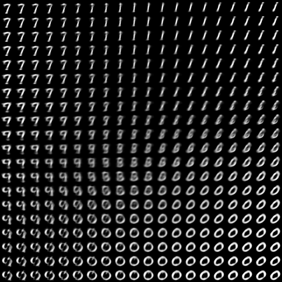

An [MXNet](https://mxnet.incubator.apache.org/) implementation of the variational autoencoder model proposed in [1]. 

`core.py` implements the model and loss function. 

`train_mnist.py`trains a variational autoencoder on MNIST dataset. The above picture shows the 2D latent space for a model trained with the default parameters.

```
usage: vae.py [-h] [--batch_size BATCH_SIZE] [--input_height INPUT_HEIGHT]
              [--input_width INPUT_WIDTH]
              [--num_encoder_units NUM_ENCODER_UNITS]
              [--num_decoder_units NUM_DECODER_UNITS]
              [--latent_dim LATENT_DIM] [--learning_rate LEARNING_RATE]
              [--num_train_samples NUM_TRAIN_SAMPLES]
              [--num_val_samples NUM_VAL_SAMPLES] [--val_freq VAL_FREQ]
              [--gpu]

Train a variational autoencoder on MNIST dataset

optional arguments:
  -h, --help            show this help message and exit
  --batch_size BATCH_SIZE, -b BATCH_SIZE
                        Batch size
  --input_height INPUT_HEIGHT, -hh INPUT_HEIGHT
                        Height of input image
  --input_width INPUT_WIDTH, -ww INPUT_WIDTH
                        Height of input image
  --num_encoder_units NUM_ENCODER_UNITS, -e NUM_ENCODER_UNITS
                        Number of units in encoder hidden layer
  --num_decoder_units NUM_DECODER_UNITS, -d NUM_DECODER_UNITS
                        Number of units in decoder hidden layer
  --latent_dim LATENT_DIM, -l LATENT_DIM
                        Latent space dimension (number of elements)
  --learning_rate LEARNING_RATE, -r LEARNING_RATE
                        Learning rate
  --num_train_samples NUM_TRAIN_SAMPLES, -t NUM_TRAIN_SAMPLES
                        Number of training samples
  --num_val_samples NUM_VAL_SAMPLES, -v NUM_VAL_SAMPLES
                        Number of validation samples (per validation run)
  --val_freq VAL_FREQ, -f VAL_FREQ
                        Validation frequency (run validation every val_freq
                        training samples)
  --gpu                 If True, train on GPU

```


[1] Kingma, D. P., & Welling, M. (2013). Auto-Encoding Variational Bayes. arXiv:1312.6114

